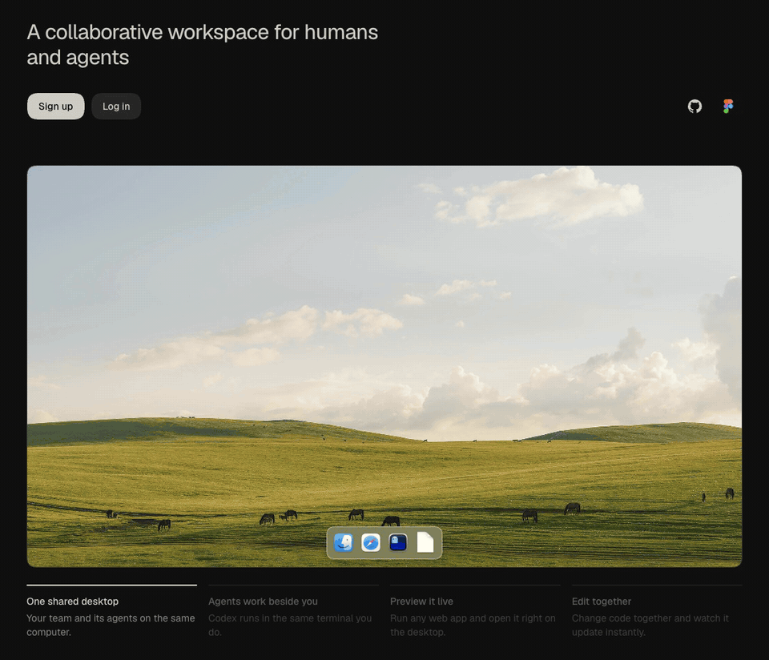

<picture>
  <source srcset="./docs/brand/logo-dark.svg" media="(prefers-color-scheme: dark)"/>
  
</picture>

### tomo

a collaborative workspace for humans and agents.
<br/>
[tomo.computer](https://tomo.computer)

<br/>

<a href="https://tomo.computer"></a>

<br/>
<br/>


<br/>

work is multiplayer. computers are single-player. tomo gives every team one persistent cloud computer in the browser, where people and agents work side by side and nothing needs to be sent anywhere.

- **shared desktop.** windows, a dock and several desktops, the same for everyone
- **live terminal.** a real shell that every member types into together
- **co-editing.** files and notes edited at the same time, synced with Yjs
- **agents in the room.** Codex runs on the same machine and touches the same files you do
- **persistent.** close the tab and the computer is still there tomorrow

<br/>

### how it works


each workspace is its own Docker container with Python, Node, git and Playwright. the API streams terminals to everyone connected and syncs desktop state over WebSockets. all of it runs on a single Google Cloud VM. there's a [more detailed diagram](./docs/architecture/architecture.png) too.

| | |
| --- | --- |
| `packages/web` | React Router, Vite, Tailwind |
| `packages/api` | Node, Hono, Drizzle + SQLite, dockerode, Yjs |
| `packages/api/src/sandbox` | the workspace image |
| `infra` | OpenTofu, cloud-init, Caddy |

<br/>

### run it

```sh
cp .env.example .env
pnpm install
pnpm sandbox:build
pnpm dev
```

needs Node 22, pnpm and a running Docker daemon. fill in `BETTER_AUTH_SECRET`, and `OPENAI_API_KEY` if you want the agent. the database migrates itself on boot.

<br/>
<br/>

<div align="right">
<i>made by two friends, manu &amp; chris</i> &nbsp;&bull;&nbsp; <a href="./LICENSE">MIT</a>
</div>
